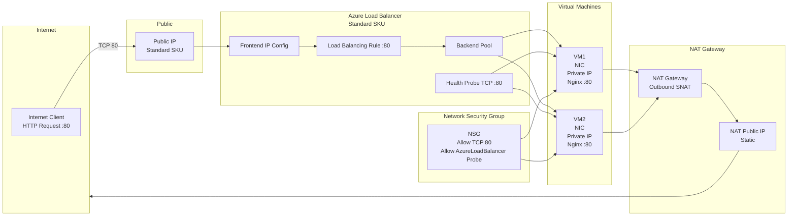

```mermaid
flowchart LR

    subgraph Internet
        Client[Internet Client<br/>HTTP Request :80]
    end

    subgraph Public
        PIP[Public IP<br/>Standard SKU]
    end

    subgraph LB["Azure Load Balancer<br/>Standard SKU"]
        LBF[Frontend IP Config]
        LBR[Load Balancing Rule :80]
        LBP[Health Probe TCP :80]
        BE[Backend Pool]
    end

    subgraph Compute["Virtual Machines"]
        VM1[VM1<br/>NIC<br/>Private IP<br/>Nginx :80]
        VM2[VM2<br/>NIC<br/>Private IP<br/>Nginx :80]
    end

    subgraph Security["Network Security Group"]
        NSG[NSG<br/>Allow TCP 80<br/>Allow AzureLoadBalancer Probe]
    end

    subgraph NAT["NAT Gateway"]
        NATPIP[NAT Public IP<br/>Static]
        NGW[NAT Gateway<br/>Outbound SNAT]
    end

    %% Inbound flow
    Client -->|TCP 80| PIP
    PIP --> LBF
    LBF --> LBR
    LBR --> BE

    BE --> VM1
    BE --> VM2

    LBP --> VM1
    LBP --> VM2

    NSG --> VM1
    NSG --> VM2

    %% Outbound flow
    VM1 --> NGW
    VM2 --> NGW
    NGW --> NATPIP
    NATPIP --> Internet
```

